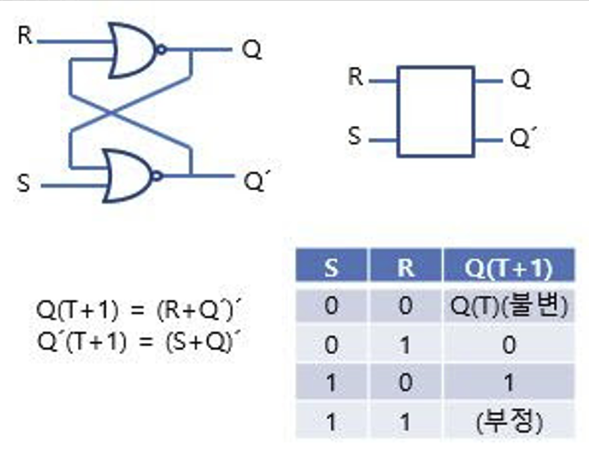

# CPU

### 어떻게 데이터를 저장할까?

입력과 출력은 데이터를 저장할 곳이 있어야 정보를 저장할 수 있습니다.

정보를 저장할 수 있는 회로는 부정 논리곱 게이트(non-conjunction gate) 두 개를 조합하여 만들 수 있습니다. (래치라고도 한다)


첫 번째 NOR 연산이 두 번째 NOR 연산으로 들어갑니다.

S와 R의 입력에 따라 상태가 바뀌게 됩니다.

- S=1이고, R=0이면 SET 상태라고 합니다.
- S=0이고, R=1이면 RESET 상태라고 합니다.
- S=0이고, R=0이면 유지 상태라고 합니다.
- S=1이고, R=1이면 금지 상태라고 합니다. (Q와 Q'는 서로 반대여야 하기 때문에)

### 레지스터와 메모리의 탄생

래치를 사용하면 1비트를 저장할 수 있습니다. 이제 여러 개의 래치를 사용해 더 많은 비트를 저장할 수도 있습니다. 이것을 레지스터라고 합니다.

```
💡 레지스터란? 레지스터는 CPU 내부의 고속 메모리로, 명령어 실행과 데이터 처리를 위해 일시적으로 데이터를 저장합니다.
주요 역할은 데이터 이동, 주소 계산, 명령어 실행 등을 포함합니다.
```

### 하드웨어 아니면 소프트웨어? 범용 장치

CPU는 연산의 능력만 제공하고, 프로그래머가 피연산자를 제공함으로써 효율적으로 동작할 수 있습니다.

CPU의 표현방식은 명령어 집합을 사용해서 구현돼야 합니다.

직접 명령어 집합을 사용하여 프로그래밍 하는 것은 번거롭기 때문에 고급 프로그래밍 언어로 코드를 작성하고 컴파일하는 과정을 거칩니다.

### 회로에는 지휘자가 필요하다.

가산기가 작동할 때 레지스터 R1과 R2가 반드시 1을 저장하도록 어떻게 보장할 수 있을까?

각 부분의 회로가 함께 작업할 수 있도록 조정하거나 동기화하려면 어떻게 해야 할까요?

CPU에서는 클럭 신호(clock signal)을 사용해 전압이 변경될 때마다 전체 회로 상태를 갱신해 동기화 작업을 합니다. 따라서, 클럭 주파수가 높을 수록 더 많은 작업을 할 수 있습니다.

# CPU는 유후 상태일 때 무엇을 할까?

### 프로세스 관리와 스케쥴링

작업 관리자를 열어 확인해보면 System Idle Process 항목이 CPU 사용률이 높습니다.

해당 프로세스는 스케쥴러로써, 프로세스에 우선 순위를 할당하고 대기열에 넣어 스케쥴링한다.

### 대기열 상태 확인

대기열이 비어있다면 CPU가 Idle 상태에 있다는 것을 의미합니다.

```powershell
if(queue.empty())
{
	do_something();
}
```

커널은 If 예외가 가득하기 때문에 위와 같은 코드는 번잡하게 보일 수 있습니다.

따라서, 예외처리가 없는 설계를 위해 다음과 같이 구현합니다.

대기열을 가득채워 스케쥴러가 대기열에서 항상 실행할 수 있는 프로세스를 찾게 합니다.

해당 프로세스가 바로 System Idle Process입니다.

CPU는 halt 라는 커널 상태 명령어를 통해 정지하고, 전력 소비를 줄일 수 있게 설계됐습니다.

따라서, halt 명령어를 실행한 후라면 프로그래머는 다시 CPU에서 명령어를 실행할 방법이 없게 됩니다.

이제 CPU가 더 이상 실행할 수 있는 프로세스가 존재하지 않으면 halt 명령어를 계속 순환적으로 호출해 저전력 상태로 돌아갑니다.

```powershell
while(1)
{
	while (!need_resched())
	{
		cpuidle_idle_call();
	}
}
```

이렇게 while(1)로 무한 루프를 순회하는데 어떻게 빠져나올까요?

CPU는 일정 시간마다 타이머 인터럽트를 생성하고, 인터럽트 처리 프로그램을 실행합니다.

인터럽트 처리 함수에서는 준비 완료된 프로세스를 확인하고 있다면 중지, 실행을 시켜 스케줄링하고 없다면 Idle 상태로 돌아갑니다.
