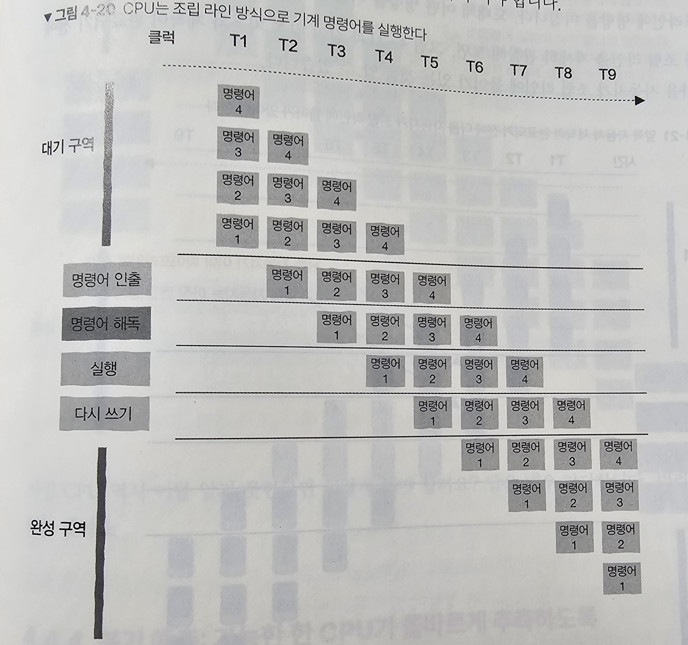

# 파이프라인

## 파이프라인 기술

CPU는 기계 명령어를 처리하는 과정에서 `명령어 인출`, `명령어 해독` , `실행` , `다시 쓰기` 단계를 거친다.

각각의 작업단계가 독립적으로 실행되며 결과물을 다음 단계로 전달한다.



파이프라인 기술은 전체 실행 시간을 줄이는 것이 아니라 CPU의 처리 능력을 늘리는 것이다.

## 분기 예측

파이프라인에서 if 문을 만나면

- 분기해야할 목적지는 분기 점프 명령어의 실행이 끝나야 알 수 있다
- 분기 점프 명령어를 실행하는 동안 다음 명령어는 이미 파이프라인에 들어간다.

→ CPU는 미리 분기의 결과를 예측하여 이를 토대로 다음 명령어를 실행한다.

### 예시

```cpp
const unsigned arraySize = 10000;
int data[arraySize];

long long sum = 0;
for (unsigned i = 0; i < 100000; ++i)
{
    for(unsigned j = 0; j < arraySize; ++j)
    {
        if(data[c] >= 128)
        {
            sum += data[c];
        }
    }
}
```

이 코드의 실행결과는 정렬이 수행됐을 때에는 2.8초이고, 정렬이 안됐을 경우 7.5초가 걸린다.

### likely/unlikey 매크로

CPU의 분기 예측 성공률이 높을수록 프로그램 성능이 좋아진다.

→ `likey/unlikey` 매크로를 통해 컴파일러에게 가능성이 높은 분기에 대해 알려주어 성능을 향상시킬 수 있다.

```
❓Javascript에서도 분기 예측이 일어날까?

분기 예측은 CPU 단에서 일어나는 하드웨어적인 최적화이고,
Javascript에서는 다음과 같은 최적화를 진행한다.
    1. JIT (Just-In-Time) 컴파일
    2. 인터프리터와 컴파일러의 조합
    3. 가비지 컬렉션(Garbage Collection)
    4. 최적화 힌트 및 프로파일링
```
