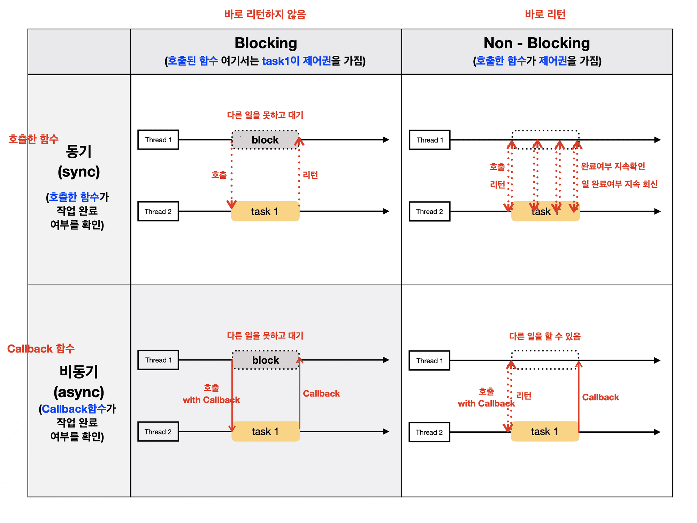
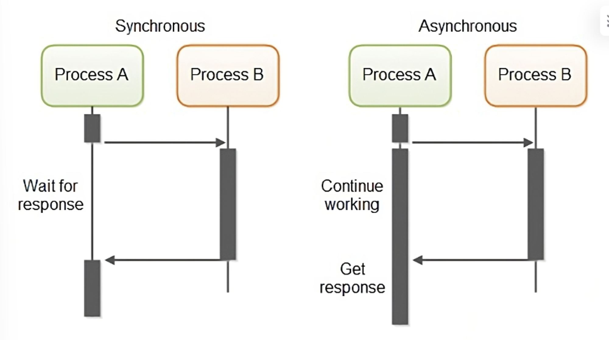

# 동기 비동기와 블로킹 논블로킹

동기 비동기를 이해하려면 콜백 함수에 대해서 알아야 합니다.

```
💡 콜백 함수는 전역 변수처럼 함수를 변수처럼 선언하여 함수의 인자로 넘기는 것을 말한다.
```


## 동기
일반적으로 두 작업이 서로의 작업이 완료될 때까지 기다리면 동기작업입니다. 먼저 실행된 작업이 완료될 때 까지 다음 작업을 블로킹합니다

예를 들어,  함수를 호출하고 그 함수의 실행이 끝날 때까지 기다린 후 다음 라인의 코드를 실행하는 것이 동기의 예시가 될 수 있습니다. 


## 비동기
비동기는 작업의 완료를 기다리지 않고 다음 작업을 진행합니다. 작업의 실행 순서가 보장되지 않으며, 작업이 동시에 실행될 수 있습니다.

예를 들어, AJAX 요청을 보내고 서버의 응답을 기다리지 않고 다른 작업을 수행하는 것. 응답이 도착하면 콜백 함수를 통해 결과를 처리하는 것이 비동기의 예시입니다.



## 블로킹
블로킹은 작업을 요청한 후 해당 작업이 완료될 때까지 다른 작업을 수행할 수 없는 상태를 뜻합니다. 호출된 함수가 제어권을 반환하지 않고 작업이 완료될 때까지 대기하는 것을 말합니다.

예를 들어, 파일을 읽는 동안 프로그램의 실행이 멈추고 파일 읽기 작업이 완료될 때까지 기다리는 것이 블로킹의 예시입니다. 

## 논블로킹
논블로킹은 작업을 요청한 후 해당 작업의 완료 여부와 관계없이 다른 작업을 수행할 수 있는 상태를 뜻합니다. 호출된 함수가 즉시 제어권을 반환하여 다른 작업을 진행할 수 있습니다.

예를 들어, 소켓 통신에서 데이터를 보내고 받을 때, send() 함수를 호출한 후 즉시 다른 작업을 수행할 수 있는 것, 데이터 전송이 완료되면 이벤트나 콜백을 통해 알림을 받는 것이 논블로킹의 예시입니다.

## 조합
- 동기 블로킹: 작업을 요청하고 해당 작업이 완료될 때까지 기다리며, 그 동안 다른 작업을 수행할 수 없습니다.
- 동기 논블로킹: 작업을 요청하고 즉시 제어권을 반환받아 다른 작업을 수행할 수 있지만, 요청한 작업의 완료 여부를 주기적으로 확인해야 합니다. (확인하는 과정을 폴링이라고 합니다)
- 비동기 블로킹: 작업을 요청한 후 다른 작업을 수행할 수 있지만, 특정 시점에서 요청한 작업의 결과를 기다리기 위해 블로킹될 수 있습니다.
- 비동기 논블로킹: 작업을 요청한 후 해당 작업의 완료와 관계없이 다른 작업을 수행할 수 있으며, 작업 완료 시 콜백이나 이벤트를 통해 결과를 처리합니다.

디스크 한 번 읽는 것은 ms 단위이지만, CPU는 GHz에 도달해 있기 때문에, 입출력 과정이 이루어질 땐 다른 프로세스를 실행 하도록 해야 합니다.
