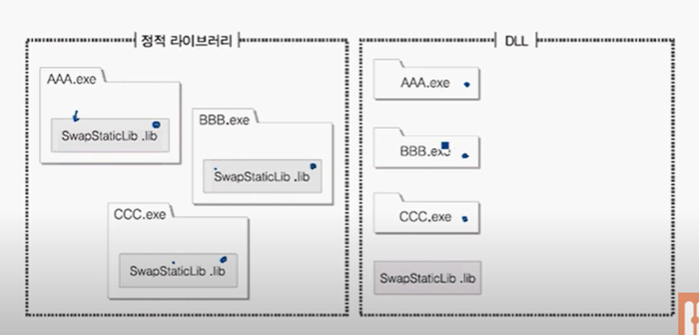

# 링커

: 컴파일 결과로 소스 파일 하나 당 각각의 대상 파일이 생성된다. 이 여러 개의 대상 파일을 하나의 실행 파일로 합쳐주기 위해 `링크` 라는 동작을 수행하고, 이 역할을 담당하는 프로그램이 `링커`이다.

## 1. 심벌 해석

: 컴파일러가 컴파일 과정에서

- 외부에서 정의된 전역 변수는 데이터 영역에, 함수는 코드 영역에 저장한다.
- 외부 심벌 정보를 `심벌 테이블` 에 기록함.

링커는 이를 바탕으로 대상 파일에서 참조하고 있는 외부 심벌(전역 변수, 함수)마다 정의가 하나만 존재하는지 확인한다.

## 2. 실행 파일 생성

### 정적 라이브러리/동적 라이브러리

실행파일 각각이 lib을 내부에 가지고 있는 것이 정적 라이브러리이고,
lib과 실행파일이 별도로 존재하여 lib을 공유하면서 사용하는 것이 동적 라이브러리이다.

## 3. 재배치

1. 컴파일러
   1. 컴파일러는 컴파일 시점에 메모리 주소를 알 수 없기 때문에 간단한 메모리 주소를 지정한다.
   2. 메모리 주소를 확정할 수 없는 변수를 발견할 때마다 `.relo.text`에는 명령어를, `.relo.data`에는 관련 데이터를 저장 (obj 파일)
2. 링커
   1. 코드 영역은 코드 영역끼리, 데이터 영역은 데이터 영역끼리 병합
   2. 실행 시간에 위치할 메모리 위치 결정
   3. relo 파일을 통해 소스 주소를 확정된 주소로 수정
