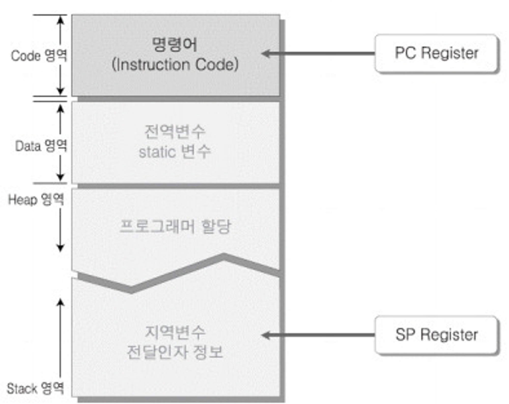
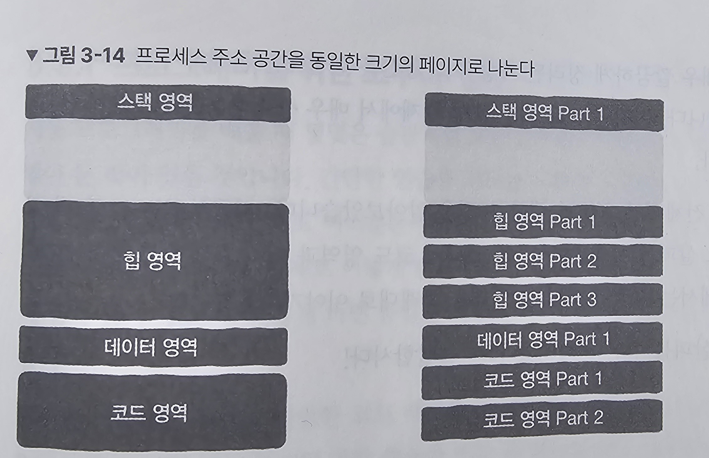
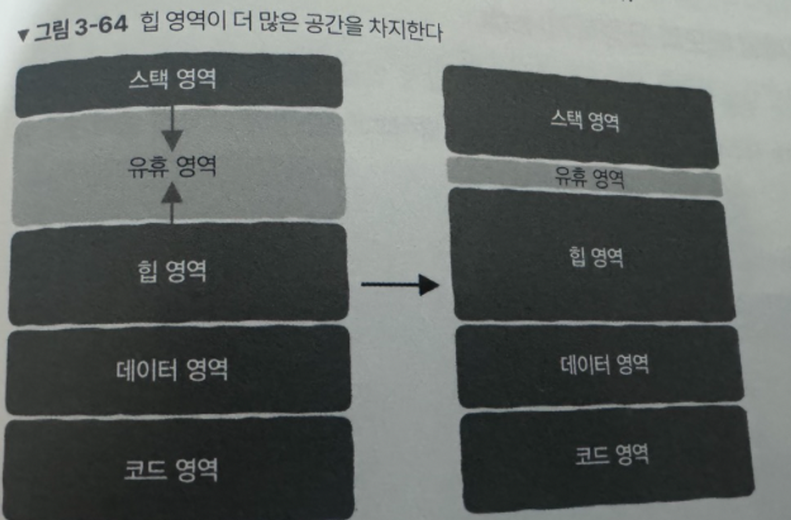

# 가상 메모리

컴퓨터에서 물리적인 메모리를 추상화하여 프로세스에게 할당하는 기술이다. 이를 통해 프로세스는 메모리를 독점하는 것처럼 사용할 수 있게 합니다.

> **왜 프로세스가 독립된 메모리를 가지게 해야 하나요?** 프로세스는 독립된 메모리 공간을 가지지 않는다면, 다른 프로세스의 메모리에 접근하여 문제를 일으킬 수 있습니다. 또한, 프로그래머가 다른 프로세스 사용에 대해 고려하지 않고 개발을 할 수 있게 된다는 장점이 존재합니다.

프로그램이 시작되면 메모리에 프로세스가 적재되는데, 그림과 같은 구조를 가진 가상 메모리가 적재됩니다. 물리적으로 존재하지 않지만, 그림과 같은 구조를 통해 프로세스가 마치 모든 메모리를 독점하고 있는 것처럼 착각하게 만듭니다. 32비트 시스템에서는 2^32바이트인 4GB 메모리를 독점하고 있다고 생각하게 합니다.



### 실제 물리 메모리에서는?

1. 프로세스는 동일한 크기의 조각(chunk)으로 나뉘어 물리 메모리에 저장됩니다.
2. 모든 조각은 물리 메모리 전체에 무작위로 흩어져 있습니다.

## 페이지와 페이지 테이블

`페이지` : 프로세스 주소 공간을 동일한 크기로 나눈 것

`페이지 테이블` : 각각의 프로세스는 가상 메모리와 물리 메모리 사이 관계를 가지는 페이지 테이블을 가진다.

→ 모든 프로세스는 코드 영역 `0x400000`(가상 메모리 주소)에서 프로그램을 시작한다. 서로 다른 프로세스에서 같은 가상 메모리 주소를 사용해도 괜찮은 이유는 각 프로세스 마다 페이지 테이블을 가져 실제 mapping된 물리 메모리 주소는 다를 수 있기 때문이다.

### ❓`사상은 페이지 단위로 이뤄지기 때문에 페이지 테이블이 가져야 하는 항목 수가 줄어듭니다.`



쉽게 설명하면, 32비트 주소 공간에서는 4GB의 가상 주소 공간이 있어, 페이지 테이블도 4GB를 가져야 하지만, 4KB 페이지 단위로 조각을 나누게 되면 최대 100만개의 페이지 테이블만 가지면 되기 때문에 테이블의 크기가 줄어듭니다.

## 메모리를 할당할 때 저수준 계층에서 일어나는 일

x86 cpu에서는 커널과 사용자 상태로 사용할 수 있는 명령어의 권한이 다릅니다.

|      | 커널 상태                                         | 사용자 상태                                       |
| ---- | ------------------------------------------------- | ------------------------------------------------- |
| 정의 | CPU가 운영체제의 코드를 실행                      | CPU가 사용자(프로그래머)가 작성한 코드를 실행     |
| 제한 | 모든 명령어 실행 가능 및 모든 주소 공간 접근 가능 | 특정 주소 공간 접근 금지 및 특정 명령어 실행 금지 |

```
💡 시스템 콜이란? 운영 체제와 응용 프로그램 간 통신할 수 있는 인터페이스입니다.
응용 프로그램이 운영 체제의 커널에 직접 접근하여 파일 조작과 같은 작업을 할 수 있게 합니다.
```

운영체제 별 시스템 콜 방식이 다르기 때문에 응용 프로그램에서는 표준 라이브러리를 사용합니다.

```
💡 표준 라이브러리란? 운영 체제별 차이를 추상화하여 동일 함수 호출로 다양한 운영 체제에서 일관된 시스템 콜을 실행할 수 있도록 합니다.
표준 라이브러리 함수에는 **입출력(IO)나 네트워크 라이브러리가** 존재합니다.
```

### 힙 영역의 메모리가 부족할 때

프로그래머는 표준 라이브러리 함수인 malloc을 사용해 메모리 할당을 합니다. 하지만, 메모리 공간이 부족하다면 여유 공간으로 부터 공간을 점유합니다.


실제로 힙 영역에서 공간이 부족해 여유 공간으로 최상단 포인터를 이동하려면 리눅스의 경우 시스템 콜을 사용해 brk라는 변수 값을 위로 이동해 힙 영역을 확장합니다. 따라서, 메모리 할당에는 운영 체제의 개입이 들어갈 수 있습니다.

### 빙산의 아래: 가상 메모리가 최종 보스다

위에서 작성한 내용은 사실 모두 가상 메모리에서 이뤄지며 물리 메모리에서는 아무 일도 일어나지 않습니다.

malloc은 마치 공수표처럼 가상 메모리 주소를 반환하고, 실제 물리 메모리는 할당조차 되지 않을 수도 있습니다.

실제 메모리는 사용되는 순간에 할당되게 됩니다. 이때 가상 메모리가 아직 실제 물리 메로리와 연결되지 않으면, 내부적으로 페이지 누락 오류(page fault)가 발생할 수 있습니다. 운영 체제는 페이지 누락 오류를 감지해 페이지 테이블을 수정하여 실제 물리 메모리가 할당되게 됩니다.

하지만 이렇게 시스템 콜을 사용해 사용자 모드와 커널 상태를 왔다갔다하는 것은 성능에 영향을 미칩니다. 어떻게 이를 해결할 수 있을까요? [메모리풀](https://github.com/MZ-Books/The_Secret_of_the_Underlying_Computer/blob/main/%EB%A9%94%EB%AA%A8%EB%A6%AC/%EB%A9%94%EB%AA%A8%EB%A6%AC%ED%92%80.md)
