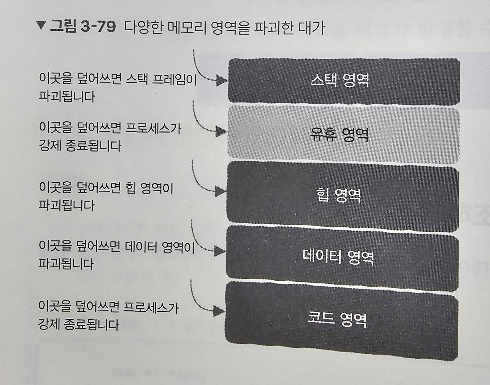

# 대표적인 메모리 관련 버그

- 지역 변수의 포인터 반환하기

```cpp
int * func()
{
	int a = 2;
	return &a;
}

void main()
{
	int* p = func(); // 함수가 이미 생성하고 소멸했기 때문에 포인터가 이미 없는 변수를 가리킴.
	*p = 20; // error!
}

```

- 포인터 연산의 잘못된 이해

```cpp
int sum(int *arr, int len)
{
    int sum = 0;
    for (int i = 0; i < len; i++)
    {
        sum += *arr;
        arr += sizeof(int); // 데이터 형식을 신경쓸 필요없다. 1을 증가시키면 자동으로 단위 만큼
    }
    return sum;
}
```

- 문제 있는 포인터 역참조하기

```cpp
int a;
scanf("%d", a); //scanf는 a를 주소로 취급한다.
// a의 값이 어떻게 해석되는지에 따라 여러 결과를 가져온다.
// 1. 코드 영역의 메모리라고 해석되면 즉시 강제 종료된다.
// 2. 스택 영역을 가리키는 포인터로 해석되면 스택 프레임이 파괴돼 프로그램의 메모리 구조가 망가진다.
// 3. 힙 영역 또는 데이터 영역을 가리키는 포인터로 해석되면 동적 할당된 메모리가 파괴돼 2와 같다.
```

- 초기화되지 않은 메모리 읽기

```cpp
void add()
{
    int* a = (int*)malloc(sizeof(int)); // 힙 영역에 할당, 늘 초기화된 메모리를 보장x
    *a += 10; // 초기화되지 않아서 0이 아닐 수 있음.
}
```

- 이미 해제된 메모리 참조하기

```cpp
void add()
{
    int* a = (int*)malloc(sizeof(int));
    free(a);
    int b = *a; // 해제된 메모리에 다시 접근한다.
    // 해당 메모리 조각이 다시 할당되지 않았다면 이전과 동일한 값이다.
    // 메모리 조각을 malloc이 다시 사용한다면, 데이터가 덮어씌워졌다.
}
```

- 배열 첨자는 0부터 시작한다

```cpp
int *arr = (int*)malloc(sizeof(int) * 10);
for (int i = 0; i <= 10; i++) // 0에서 10까지 동작하므로 11번지 메모리에 접근한다.
{
    arr[i] = i; // i가 10일때 error!
}
```

- 스택 넘침

```cpp
void buffer_overflow()
{
    char buf[32]; // 32바이트가 스택 공간에 남아있을 것이라고 가정된 코드
    gets(buf);

    return;
}

// 스택 공간이 가득찬 경우 가장 가까운 데이터를 침범하게 돼 버그가 발생합니다.
// 해커가 스택 버퍼를 이용해 스택 프레임의 주소를 악성 코드로 덮어쓰면 악성 코드가 실행될 수도 있다
```

- 메모리 누수
  함수에서 메모리를 요청한 후 다시 해제하지 않고 반환하면 해당 메모리는 다시 해제할 수 있는 방법이 없습니다.

## 메모리 파괴 효과


