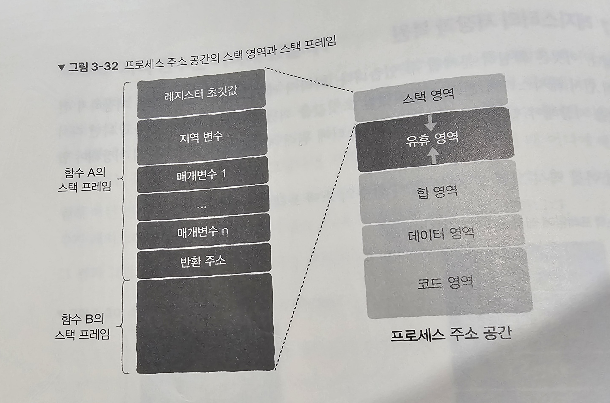

# 3-3. 스택 영역: 함수 호출은 어떻게 구현될까?

함수 runtime stack / 함수 call stack 이해하기

## 1. 프로그래머를 위한 도우미: 함수

함수는 일종의 추상화로써, 실질적인 구현과 상관없이 기능을 이용할 수 있게 + 코드를 재사용하기 위한 목적으로 사용한다.

## 2. 함수 호출 활동 추적하기: 스택

함수의 호출 관리는 스택 자료구조 형태를 사용하여 관리한다.
→ 이진 트리의 탐색과 같은 과정을 통해 함수의 호출을 관리한다.

## 3. 스택 프레임 및 스택 영역: 거시적 관점

`스택 프레임` : `콜 스택` 이라고도 불리며 함수 실행에 필요한 정보들을 저장한다.
→ 스택 영역 내부에 높은 주소에서 낮은 주소의 방향으로 스택 프레임들이 쌓인다.

## 4. 함수 점프와 반환은 어떻게 구현될까?

함수 A에서 함수 B를 호출하면 CPU의 제어권이 A에서 B로 바뀐다.
→ 제어권 이전을 위해서는 반환(출처 정보)과 점프(목적지 정보)가 필요하다.

- 반환: call 명령어 실행 당시 현재 명령어 다음에 위치한 주소를 스택 프레임이 넣어 함수 B 실행 이후 다시 돌아올 수 있도록 함.
- 점프: 제어권 이전을 위한 기계 명령어에 명시 ex. call 0x400540 → 0x400540이 점프

## 5. 매개변수 전달과 반환값은 어떻게 구현될까?

: 레지스터에 저장

단, 매개변수 수가 레지스터 수보다 많다면 나머지 매개변수는 스택 프레임에 저장

```markdown
#❗ 메인 메모리와 CPU 메모리

1. 메인 메모리(Main Memory 또는 RAM):

      - 메인 메모리는 프로그램이 실행되는 동안 데이터와 명령어를 저장하는 주 기억 장치입니다.

      - 주로 다양한 종류의 RAM(Random Access Memory)을 사용하며, 휘발성 메모리로 전원이 꺼지면 저장된 데이터가 사라집니다.

      - 메인 메모리는 프로그램의 코드, 변수, 스택, 힙 등을 저장하며, 프로그램이 실행되는 동안에만 데이터가 유지됩니다.

      - CPU가 데이터나 명령어에 접근할 때 메인 메모리에서 필요한 정보를 가져와 처리하며, CPU의 레지스터와 캐시 메모리 등을 통해 데이터를 읽고 쓸 수 있습니다.

2. CPU 내부 메모리:

      - CPU 내부 메모리는 CPU 내부에 위치한 속도가 매우 빠른 기억장치입니다.

      - 대표적으로 레지스터(Register)와 캐시 메모리(Cache Memory)가 있습니다.

      - 레지스터는 CPU가 명령어를 실행하고 데이터를 처리할 때 사용하는 매우 빠른 메모리로, 일반적으로 매우 제한된 개수의 레지스터가 있습니다.

      - 캐시 메모리는 메인 메모리에서 자주 사용되는 데이터나 명령어를 저장하는 작은 용량의 고속 메모리로, CPU와 메인 메모리 간의 속도 차이를 줄이기 위해 사용됩니다.

      - CPU 내부 메모리는 빠른 액세스 속도를 제공하여 CPU의 성능을 향상시키고, 메인 메모리와의 데이터 교환을 최소화합니다.

## 비교

- 메인 메모리는 주 기억 장치로서 프로그램의 코드 및 데이터를 저장하는 역할을 합니다. CPU 내부 메모리는 CPU 내부에 위치하여 명령어 실행 및 데이터 처리에 사용됩니다.

- 메인 메모리는 대부분의 경우 느리고, CPU 내부 메모리는 매우 빠릅니다. CPU는 속도가 빠른 내부 메모리를 이용하여 명령어를 실행하고 데이터를 처리하여 성능을 향상시킵니다.

- 메인 메모리는 용량이 크고 데이터를 보존하지만, CPU 내부 메모리는 용량이 작고 휘발성이므로 데이터를 일시적으로 저장하거나 처리하는 데 사용됩니다.
```

## 6. 지역 변수는 어디에 있을까?

- 전역 변수: 실행 파일의 데이터 영역에 저장되어 있다 프로그램이 실행되면 프로세스 주소 공간의 데이터 영역에 적재
- 지역 변수: 매개변수와 동일

## 7. 레지스터의 저장과 복원

레지스터는 CPU의 내부 리소스이므로, 서로 다른 함수가 동일한 레지스터 값을 사용하여 레지스터에 기록된 지역 변수가 변경될 수 있다.

따라서, 레지스터에 저장된 지역 변수를 사용할 때에는 기존에 저장되어 있던 값을 현 함수의 스택 프레임에 저장한 뒤 레지스터를 자유롭게 변경하여 사용하고, 사용이 끝난 이후에는 해당 초깃값을 다시 레지스터에 저장하여 복원을 시켜놓는다.

## 8. 큰 그림을 그려 보자, 우리는 지금 어디에 있을까?



스택 영역에 들어가는 데이터

(유휴 영역에는 동적 라이브러리가 적재되는 데에 사용된다.)

### 주의 사항

1. 너무 큰 지역변수 만들지 말기
2. 과한 함수 호출 단계 피하기

```markdown
# ❗ 매개변수가 너무 많아 레지스터에 저장되지 못한다는 정보는 어떻게 알 수 있을까?

매개변수가 레지스터에 저장되지 못하는 경우를 알아내는 가장 일반적인 방법은 컴파일러의 경고 메시지나 오류 메시지를 확인하는 것입니다. 대부분의 컴파일러는 함수 호출 시 레지스터에 저장할 수 있는 매개변수의 수에 제한을 두고 있습니다. 이런 제한을 초과하는 경우 컴파일러는 경고 메시지를 출력하거나 에러를 발생시킵니다.

컴파일러가 이러한 제한을 설정하는 이유는 CPU 아키텍처에 따라 레지스터의 개수와 사용법이 다르기 때문입니다. 예를 들어, x86 아키텍처의 경우 많은 레지스터를 사용할 수 있지만, ARM 아키텍처의 경우 레지스터의 개수가 제한적일 수 있습니다. 따라서 컴파일러는 해당 아키텍처에 최적화된 코드를 생성하기 위해 레지스터 사용에 대한 제한을 설정합니다.

따라서 컴파일 과정에서 발생하는 경고 메시지나 오류 메시지를 주의 깊게 살펴보면 매개변수가 레지스터에 저장되지 못하는 경우에 대한 정보를 얻을 수 있습니다.
```

```markdown
#❗ 스택 영역의 증가와 감소는 구체적으로 어떻게 구현될까?

스택 영역의 증가와 감소는 주로 스택 포인터를 이용하여 구현됩니다. 스택은 후입선출(LIFO) 구조로 되어 있어, 데이터를 저장하고 꺼내는 작업이 스택의 맨 위(가장 최근에 저장된 데이터)에서 이루어집니다. 따라서 스택에 데이터를 추가할 때는 스택 포인터를 증가시키고(증가 방향은 메모리 주소의 감소 방향), 데이터를 제거할 때는 스택 포인터를 감소시키는 방식으로 구현됩니다. 이를 통해 스택은 메모리의 일정한 영역을 차지하면서 동적으로 데이터를 저장할 수 있습니다.
```

```markdown
# ❗ 이를 구현하는 책임은 누구에게 있을까?

스택 영역의 증가와 감소를 구현하는 책임은 대부분 컴파일러나 어셈블리어에서 담당합니다. 컴파일러는 함수 호출 및 반환에 필요한 스택 프레임을 생성하고 관리하는 코드를 생성하며, 이러한 코드는 프로그래밍 언어의 규칙과 컴파일러의 구현 방식에 따라 다를 수 있습니다. 따라서 프로그래머는 스택을 직접적으로 조작하기보다는 컴파일러가 생성한 코드를 통해 스택을 제어하게 됩니다.
```
