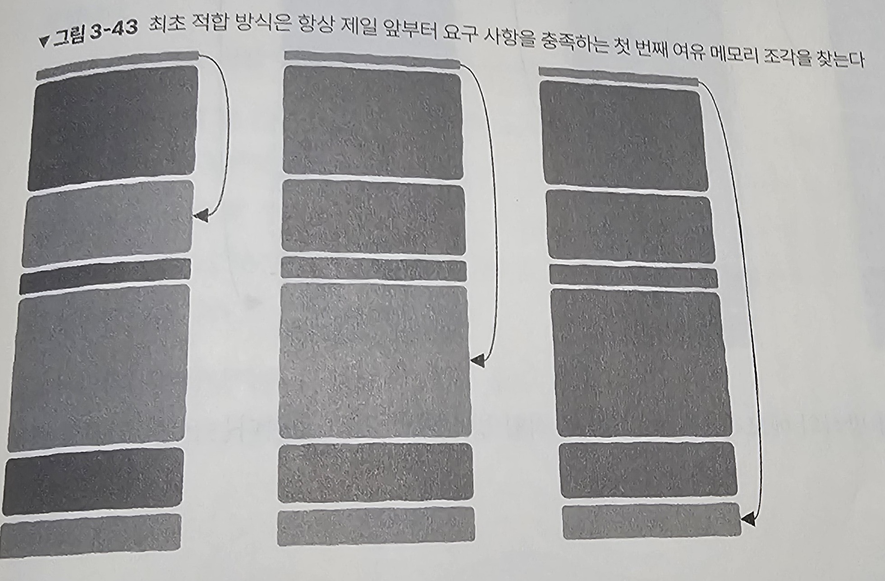
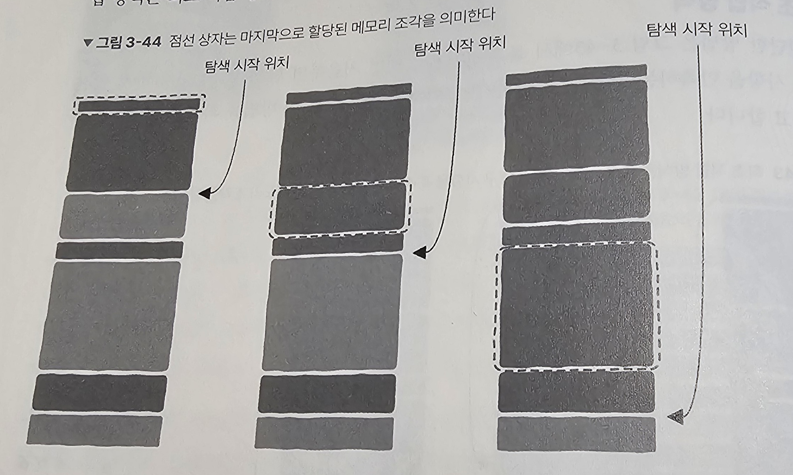
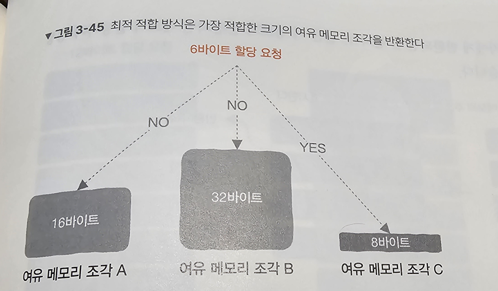

# 3-4. 힙 영역: 메모리의 동적 할당은 어떻게 구현될까?

## 1. 힙 영역이 필요한 이유

: 프로그래머가 수명 주기를 결정할 수 있는 메모리 영역을 제공하기 위함 → `동적 메모리 할당과 해제`

## 2. malloc 메모리 할당자 직접 구현하기

C/C++ 언어에서 malloc 메모리 할당자가 메모리의 동적 할당과 해제를 담당

→ malloc 함수(요청이 들어오면 가능한 메모리 영역을 찾아 반환)와 free 함수(메모리 사용 완료 처리)를 구현

## 3. 주차장에서 메모리 관리까지

- 메모리 할당 여부 파악하기
- 요청을 만족한 메모리 조각 중 어떤 메모리 조각을 반환할지 결정
- 메모리 조각에 여유가 남았다면 남은 메모리 조각의 처리
- 사용자가 반환한 메모리 처리

## 4. 여유 메모리 조각 관리하기

연결 리스트를 사용하여 메모리의 할당 여부 기록

→ 메모리 조각의 크기와 메모리 비어있는지에 대한 정보를 header에 기록, 그 외의 영역(payload)에 원하는 데이터 할당

메모리 조각의 크기를 기록하는 이유는 다음 메모리 조각의 주소를 알기 위해서이다.

## 5. 메모리 할당 상태 추적하기

header의 마지막 비트만 확인하여 빠르게 여유 메모리를 파악할 수 있다.

## 6. 어떻게 여유 메모리 조각을 선택할 것인가: 할당 전략

|        | 최초 적합 방식                                                                                                             | 다음 적합 방식                                             | 최적 적합 방식                                                       |
| ------ | -------------------------------------------------------------------------------------------------------------------------- | ---------------------------------------------------------- | -------------------------------------------------------------------- |
| 이미지 |                                                                          |           |                   |
| 정의   | 요구사항을 만족하는 메모리 중 가장 먼저 발견되는 메모리를 반환                                                             | 여유 메모리 조각이 마지막으로 발견된 위치에서 탐색 시작    | 요구사항을 만족하는 모든 메모리 조각 중 가장 크기가 작은 메모리 반환 |
| 장점   | 단순하다                                                                                                                   | 이론적으로는 최초 적합 방식보다 빠르다                     | 메모리 활용률이 좋다.                                                |
| 단점   | 앞부분에 작은 메모리 조각이 많이 남을 가능성이 높아 뒤로 갈수록 더 많은 여유 메모리 조각을 탐색해야하는 문제 생길 수 있다. | 연구 결과 최초 적합 방식보다 메모리 사용률이 비효율적이다. | 속도가 느리다.                                                       |

## 7. 메모리 할당하기

메모리 조각의 header에 할당되었다는 표시를 하고, 해당 조각의 주소(header 영역을 제외한 메모리)를 요청자에게 반환

```markdown
# ❗ 내부 단편화

: 내부 단편화는 메모리 할당과 해제로 인해 발생하는 메모리 공간의 파편화를 의미합니다. 내부 단편화는 메모리 할당 시에 사용 가능한 공간이 필요한 프로세스의 크기보다 크지만, 할당된 공간이 필요 이상으로 크게 할당될 때 발생합니다.

내부 단편화는 주로 고정 크기의 메모리 할당 단위를 사용하는 메모리 할당 방법에서 발생합니다. 예를 들어, 프로세스가 필요한 메모리 공간보다 약간 더 큰 메모리 블록을 할당받았지만, 그 프로세스가 실제로 사용하지 않는 남는 부분으로 인해 메모리가 낭비되는 상황이 내부 단편화입니다.

내부 단편화는 메모리 관리에 있어서 효율성을 감소시키고, 메모리 사용률을 저하시킬 수 있으므로, 메모리 할당 정책을 최적화하여 내부 단편화를 최소화하는 것이 중요합니다.
```

만약, 요청 받은 메모리 크기보다 더 큰 메모리를 할당해주어야 할 때에는 내부 단편화를 우려하여 여유 메모리 조각을 분할한다.

## 8. 메모리 해제하기

free와 같은 해제 함수에 메모리 요청받을 때 얻은 주소 전달하기

## 9. 여유 메모리 조각을 효율적으로 병합하기

free할 당시 해제할 메모리 조각에 인접한 메모리 조각도 비어있다면 병합할 수 있다.

1. 병합 시기 → 메모리가 해제될 당시 vs 다음 할당 때 여유 블록을 찾을 수 없는 경우 → 실제로는 대부분 여유 메모리 조각 병합 시점을 연기하여 사용한다.
2. 인접 메모리 조각의 여유 여부 → 이전에 인접한 메모리 조각의 여유 여부를 알기 위해 메모리 조각에 footer 정보 추가 (header와 동일한 역할)
