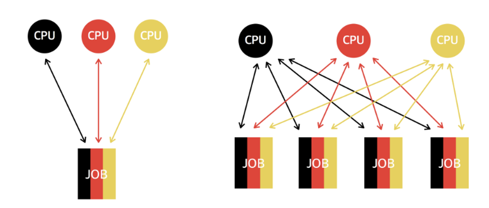

 # [프로세싱](https://inpa.tistory.com/entry/%F0%9F%91%A9%E2%80%8D%F0%9F%92%BB-multi-programming-tasking-processing)

멀티 프로그래밍: 여러 프로그램을 메모리에 올려놓고 하나의 CPU에서 번갈아가며 동시에 실행시키는 방법

멀티 태스킹: 프로세스의 작업을 아주 작은 단위로 번갈아 처리하여 작업 응답 시간 최소화 → 프로세스끼리 작업을 스위칭하는 `context switching` 개념 등장

멀티 프로세싱: 한 CPU에 두 개 이상의 코어를 사용할 수 있게 되면서 여러 CPU 코어가 동시에 작업을 처리할 수 있게 되었다.

멀티 프로세스: 멀티 프로세싱이 CPU가 멀티라면, 멀티 프로세스는 프로세스를 멀티로 사용하는 방법이다. 부모 프로세스와 여러 자식 프로세스로 이루어져 있다. ex. 브라우저

