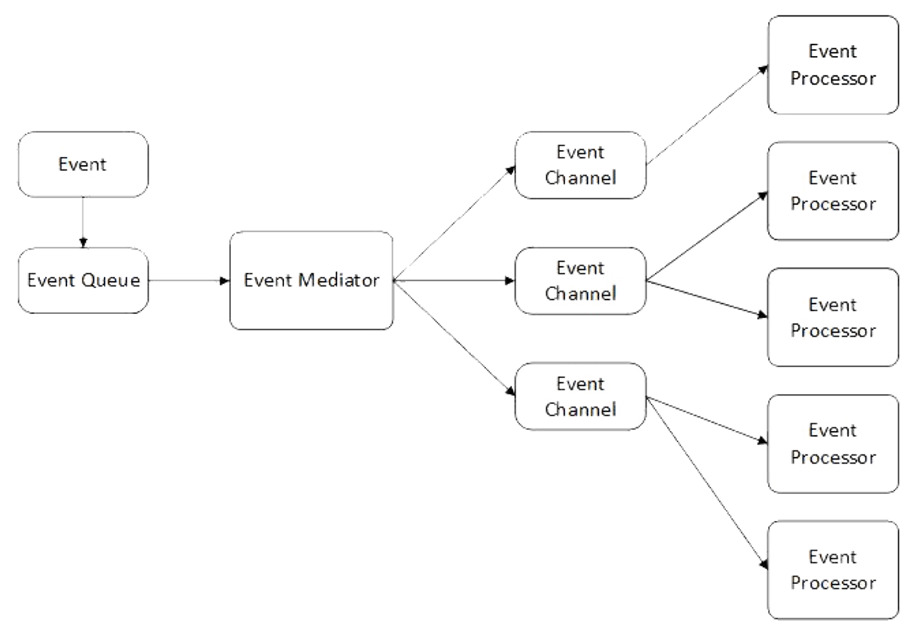

# 이벤트 기반 프로그래밍

`이벤트 기반 프로그래밍` 특정 이벤트(프로그램에 감지되고 처리될 수 있는 동작)이 일어났을 때 처리하는 함수가(이벤트 핸들러) 있는 것을 말합니다.

이벤트 중개자는 이벤트 큐에서 이벤트를 꺼내 해당 이벤트에 등록된 이벤트 채널을 호출합니다. (이벤트 중개자는 프로그램이 종료될 때까지 계속해서 이벤트를 처리합니다.)

각 이벤트 채널에서는 작업자 스레드에게 이벤트 처리를 위임해 다중 코어를 사용해 처리할 수 있게 하여 병렬처리를 할 수 있습니다.