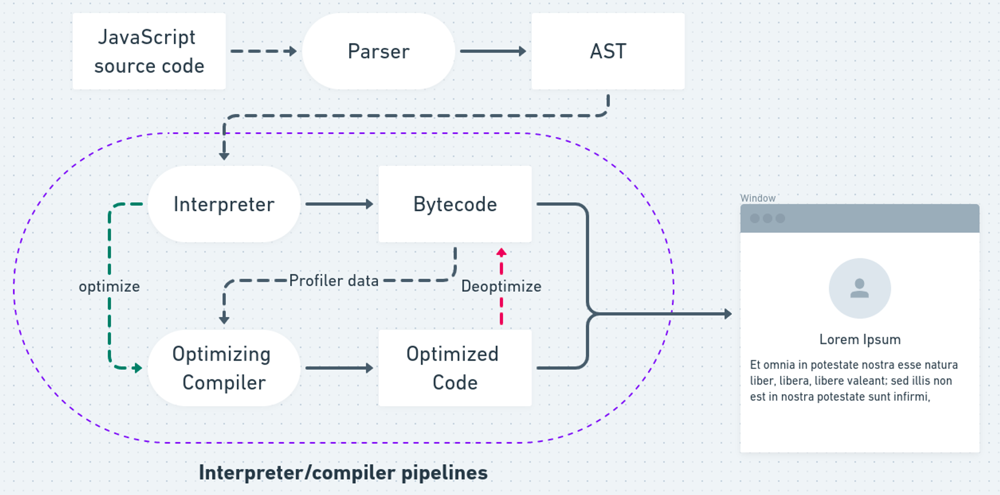

# 자바스크립트 컴파일

1. javascript 가상 머신인 v8 엔진이나 SpiderMonkey등이 스크립트를 읽는다 (파싱)
2. 인터프리터 언어이기 때문에 읽은 스크립트를 바로 기계어로 전환한다. → 사실 아님

> 💡 javascript는 동적 언어이기 때문에 JIT 컴파일러를 사용하는 경우 꽤 많은 경우의 수를 고려해야 한다. → JIT에 대해는 따로 더 알아보기..
> 그래서 js는 **`Adaptive JIT`** 이라는 방식을 사용하는데, 일단은 인터프리터 방식으로 읽고 반복되는 부분이 있다면 JIT 방식을 사용해 native code로 변환한다.

### 간단한 요약

**1) 바이트 코드로의 변환**

자바스크립트 엔진에 의해

1. 소스 코드를 파싱해(lexing, tokenizing → 이때 스코프를 결정하는 렉시컬 환경을 가진다.) 구문 트리를 만든다.
2. 의미 분석을 통해 구문 트리가 정상인지 확인한다.
3. 중간 코드를 생성한다.
4. 중간 코드를 바이트 코드로 변환한다.

**2) 기계어로 변환**

CPU마다 기계어를 다르게 해석하기에 가상 머신은 최적화된 기계어를 제작해낸다. 이 가상머신(V8 엔진 등) 덕분에 개발자는 따로 CPU별로 최적화된 기계어를 만들어낼 필요는 없다.

**3) CPU 코드 실행**

기계어를 실행하여 데이터 저장 및 연산 작업을 진행한다.

이때, hotspot을 찾아서 JIT으로 컴파일하기도 해서 인터프리터, 컴파일 특성을 모두 가진다!

### 참고자료

[https://velog.io/@wish/JavaScript는-어떻게-컴파일될까](https://velog.io/@wish/JavaScript%EB%8A%94-%EC%96%B4%EB%96%BB%EA%B2%8C-%EC%BB%B4%ED%8C%8C%EC%9D%BC%EB%90%A0%EA%B9%8C)

[https://velog.io/@seungchan\_\_y/자바스크립트는-Compiler-Interpreter-언어다](https://velog.io/@seungchan__y/%EC%9E%90%EB%B0%94%EC%8A%A4%ED%81%AC%EB%A6%BD%ED%8A%B8%EB%8A%94-Compiler-Interpreter-%EC%96%B8%EC%96%B4%EB%8B%A4)
