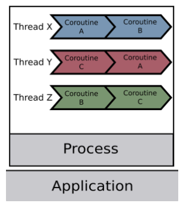

# 코루틴

코루틴은 Co(함께, 서로) + routine(규칙적 일의 순서, 작업의 집합) 2개가 합쳐진 단어로 함께 동작하며 규칙이 있는 일의 순서를 뜻합니다.

코루틴은 함수의 동작에 일시 중지와 재개 기능이 있는 것입니다. 프로그램에서 스레드는 운영체제가 관리해주지만, 사용자 상태(user mode)에서는 그렇지 않기 때문에 코루틴을 사용하여 함수를 일시 중지하고 CPU의 제어권을 넘길 수 있습니다. 

코루틴의 코루틴 컨텍스트를 통해 함수의 실행 정보를 나타내고 다음과 같은 정보를 갖고 있다. 

- 일시 중단된 위치를 나타내는 프로그램 카운터 정보
- 코루틴의 스택 영역은 힙 영역에 배치돼있고, 코루틴 내부의 지역 변수, 함수 호출 정보를 갖는다. (힙을 사용하기 때문에 스레드처럼 컨텍스트 스위칭이 일어나지 않습니다)
- 코루틴이 실행 중인지, 일시 중단된 상태인지 등을 나타내는 상태 플래그 정보를 저장한다.

따라서, 상태를 저장하는 방식으로 비동기 프로그래밍을 할 수 있게 된다.

